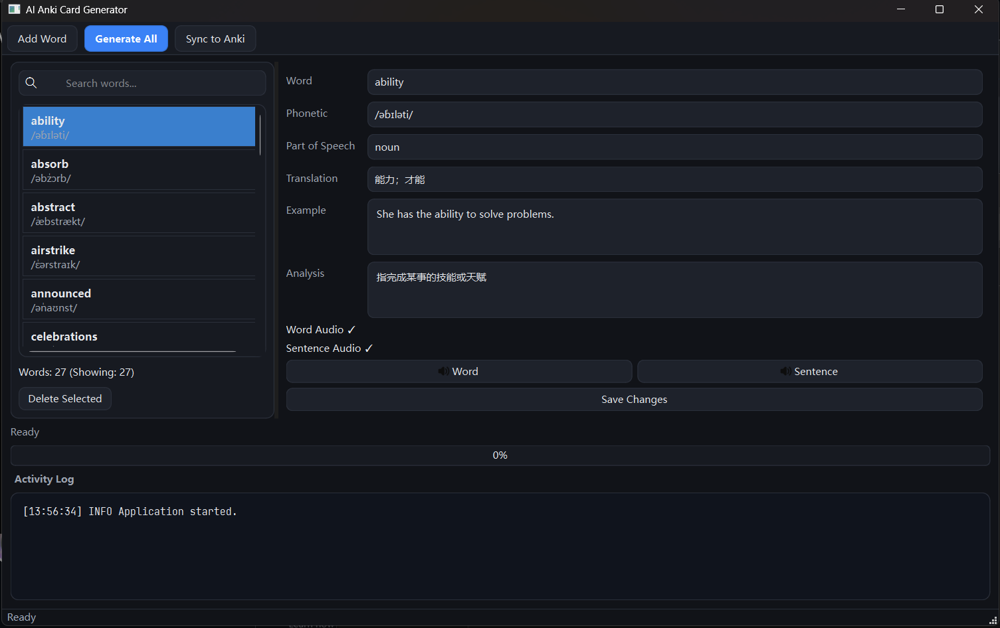
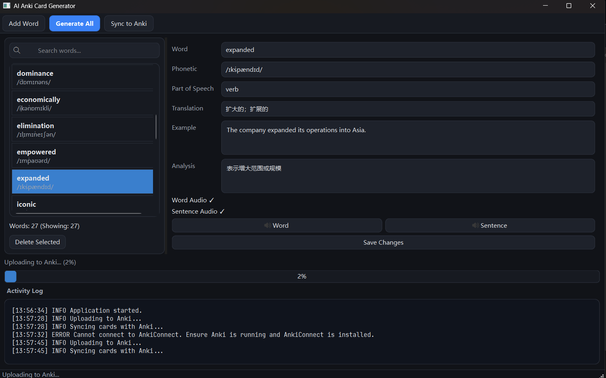

# AnkiGen

[](https://www.python.org/)
[](https://doc.qt.io/qtforpython-6/)
[](LICENSE)

一个面向英语学习者的 AI Anki 自动制卡桌面应用。  
使用 Python + PySide6 构建，支持从单词输入到 Anki 卡片同步的完整自动化流程。

---

## 1. 项目简介

手动做 Anki 单词卡往往耗时、重复、易出错：查音标、写释义、造例句、生成发音、再导入 Anki。  
**AnkiGen** 将这条流程整合为一个桌面工具：

- 输入单词（支持批量）
- 输入单词或词组（支持批量，英文逗号分隔）
- AI 自动补全词条信息
- 自动生成单词发音和例句发音
- 一键同步到 Anki（通过 AnkiConnect）

目标是让你把时间花在“记忆和复习”，而不是“整理素材”。

---

## 2. 功能特点

- AI 词条生成：自动生成音标、词性、中文释义、英文例句、用法解析
- 批量生成：使用英文逗号分隔，一次输入多个单词/词组并批量生成元数据与音频
- 桌面化管理：可视化浏览、搜索、编辑、删除词条
- 音频自动化：Edge TTS 生成单词音频与例句音频
- 音频播放与状态检查：在应用内直接试听并查看音频是否存在
- 本地数据持久化：词条存储于 `data/words.json`，音频存储于 `audio/`
- 与 Anki 深度集成：通过 AnkiConnect 上传媒体并创建/更新卡片
- 同步结果可追踪：进度条 + 日志面板显示任务状态

---

## 3. 应用截图

### 应用总览


### 词条编辑与状态日志


---

## 4. 安装方法

### 4.1 环境要求

- Python 3.10+
- Anki Desktop（建议最新稳定版）
- AnkiConnect 插件（插件 ID：`2055492159`）

### 4.2 安装依赖

```bash
cd C:\Users\kjmsd\Documents\GitHub\AnkiGen
pip install -r requirements.txt
```

### 4.3 配置环境变量

在项目根目录创建 `.env`（请勿提交真实密钥到仓库）：

```env
YUNWU_API_KEY=your_api_key
OPENAI_BASE_URL=https://yunwu.ai/v1
OPENAI_MODEL=gpt-5-mini

ANKI_CONNECT_URL=http://localhost:8765
ANKI_DECK_NAME=AI Vocabulary
ANKI_MODEL_NAME=AI Vocabulary Note

TTS_VOICE=en-US-AriaNeural
```

### 4.4 启动应用

```bash
python main.py
```

---

## 5. 使用方法

推荐工作流：

1. 点击 `Add Word`，输入一个或多个单词/词组（英文逗号分隔）
   例如：`abandon, ability, take off, in charge of`
2. 点击 `Generate All`，自动生成词条元数据与音频
3. 在右侧编辑器检查/微调词条内容
4. 点击音频按钮试听单词与例句发音
5. 点击 `Sync to Anki` 将卡片与音频同步到 Anki

生成后的词条数据示例（`data/words.json`）：

```json
[
  {
    "word": "abandon",
    "phonetic": "/əˈbændən/",
    "part_of_speech": "verb",
    "translation": "放弃；遗弃",
    "example": "He decided to abandon the plan.",
    "analysis": "表示彻底停止或遗弃某事"
  }
]
```

音频文件命名规则：

- `audio/{word}.mp3`
- `audio/{word}_sentence.mp3`

---

## 6. 技术架构

| 技术 | 作用 |
|---|---|
| Python 3.10+ | 核心语言与业务逻辑 |
| PySide6 (Qt) | 桌面 GUI（词表管理、编辑器、日志、进度） |
| OpenAI API（兼容接口） | 生成词条元数据（音标/词性/释义/例句/解析） |
| Microsoft Edge TTS | 生成单词与例句发音音频 |
| AnkiConnect | 与 Anki 通信（媒体上传、卡片创建/更新/删除） |

---

## 7. 项目结构

```text
AnkiGen/
├─ main.py
├─ gui/
│  ├─ main_window.py
│  └─ word_editor.py
├─ services/
│  ├─ gpt_generator.py
│  ├─ tts_generator.py
│  └─ anki_api.py
├─ utils/
│  └─ file_manager.py
├─ data/
│  └─ words.json
├─ audio/
├─ images/
├─ requirements.txt
└─ README.md
```

---

## 8. Roadmap

- 支持多词典来源与多语言（中英/英英）切换
- 增加学习难度分级与自动标签系统
- 增加批量导入（CSV/Markdown/TXT）模板
- 提供更完善的 Anki 双向同步与冲突解决策略
- 提供可选的云端词库备份

---

## 9. 贡献指南

欢迎提交 Issue 与 PR，一起把 AnkiGen 打造成更好用的开源学习工具。

建议流程：

1. Fork 本仓库并创建功能分支
2. 提交改动并附带清晰说明
3. 发起 Pull Request，描述变更动机与影响范围

提交前建议：

- 保持代码风格一致
- 说明复现步骤与验证方式
- 避免提交敏感信息（API Key、个人数据等）

---

## 10. License

本项目采用 **MIT License** 开源发布。  
详见仓库根目录 [LICENSE](LICENSE) 文件。
