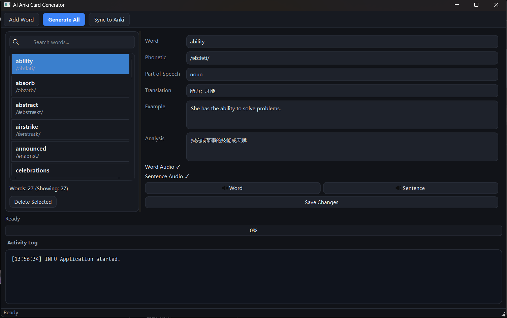
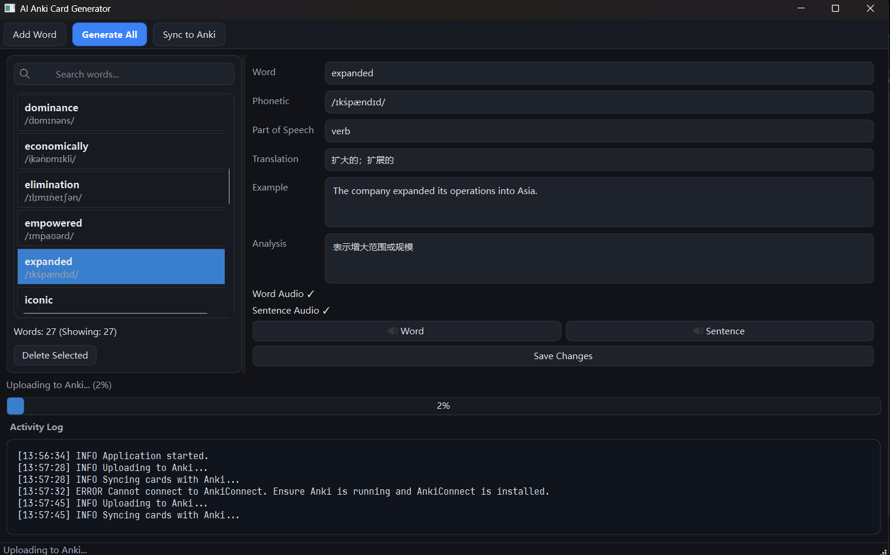

# AnkiGen

当前卡片模式为 **中文 → 英文固定搭配默写**：Anki 正面显示中文和英文输入框，翻面后显示拼写对比、标准英文答案、音标、词性、双语例句、解析和音频。拼写对比以保存的固定搭配为标准，不进行同义翻译评分。

词汇库交换与备份：

- **导入与备份 → 导入文件**：先预览再导入，不自动调用 AI。重复搭配可跳过或覆盖；覆盖前自动备份，覆盖包含空字段。之后可手动补全缺失字段和音频。
- **导出全部 / 导出所选**：Excel `.xlsx` 和 CSV 包含英文、音标、词性、中文、双语例句、解析、来源原文等字段；TXT 每行一条英文，保留搭配内部逗号。Excel 读取当前活动工作表，支持无表头单列或带 `word`（也可为“英文”“词汇”“搭配”）表头的多列表格。旧 `.xls` 请先另存为 `.xlsx`。
- **完整备份 / 从备份恢复**：ZIP 包含词库、文章历史和 MP3 音频。恢复需确认替换，恢复前自动创建回退备份；保留本机 API 配置，不包含密钥，也不会修改 Anki。普通 Excel/CSV/TXT 不包含音频，迁移设备请使用完整备份。
- `exports/vocabulary-english.txt` 随每次词库保存、导入、删除、恢复和应用启动自动更新，供 AI 参考；不是相似短语自动去重功能。`data/`、`audio/`、`exports/`、`backups/` 均不提交 Git。

分区界面：

- 左侧导航包含「词库」「文章提取」「Anki 同步」「导入与备份」，设置置于底部。
- 词库采用紧凑表格与可滚动详情侧栏；支持中英文搜索和状态筛选。Ctrl+A 只选择当前可见结果，改变筛选会清空选择；补全、音频、重试和删除只作用于选中词条。
- **Anki 同步始终针对整个词库**。本地内容或设置改变会使旧预览失效；涉及删除时再次确认。
- 文章原文与勾选候选在切换页面时保留（关闭应用不保留未提交草稿）。日志默认折叠；全局任务栏显示阶段与完成数量。
- 手动保存与 Ctrl+S 保留；有修改才启用保存，失败时保留输入。窗口尺寸、分栏和列宽仅在本机记忆，不进入词库备份。

新版工作流程：

- **词库 → 添加搭配**：多行输入，默认逗号分隔；可切换“每行一条”，保留内部逗号。实时预览并跳过已有搭配，勾选后导入。
- **文章提取**：粘贴中文、英文或双语文章，查看候选搭配及已有状态，勾选导入。文章历史保存在 `data/articles.json`，词条保存来源原文，生成时优先参考原文语境。编辑器可展开查看原文。
- **补全所选**：补缺失字段和音频，不覆盖已有内容。**音频操作**提供“仅补缺失音频”和“重新生成音频”，支持所选条目。
- **重试失败**：失败条目会保留在词库，显示原因，选中后按上次操作重试。状态包含待生成、缺音频、已完成、失败，运行时显示生成中。重启不会自动重试收费请求。
- **Anki 同步**：先显示新增、更新、删除（包含重复笔记）、跳过项，确认后才写入；执行前重新检查远端笔记列表。点击 Anki 状态按钮可检查连接。
- 编辑有未保存标记，支持 **Ctrl+S**；切换、关闭前可保存、放弃或取消。日志支持 Ctrl+A/C、清空、折叠，错误时自动展开；生成期间显示动画，结束后隐藏进度条并显示完成数量。

逗号模式中含逗号的搭配须用英文双引号包裹，例如：`"pursue safer, more nutritious and healthier food", be no longer limited to`。

同步会更新已有笔记的卡片模板，并以本地词库为准新增、更新或删除目标牌组中的笔记。音频只在答案面播放。

[](https://www.python.org/)
[](https://doc.qt.io/qtforpython-6/)
[](LICENSE)

一个面向英语学习者的 AI Anki 自动制卡桌面应用。  
使用 Python + PySide6 构建，支持从单词输入到 Anki 卡片同步的完整自动化流程。

---

## 1. 项目简介

手动做 Anki 单词卡往往耗时、重复、易出错：查音标、写释义、造例句、生成发音、再导入 Anki。  
**AnkiGen** 将这条流程整合为一个桌面工具：

- 输入单词（支持批量）
- 输入单词或词组（支持批量，英文逗号分隔）
- AI 自动补全词条信息
- 自动生成单词发音和例句发音
- 一键同步到 Anki（通过 AnkiConnect）

目标是让你把时间花在“记忆和复习”，而不是“整理素材”。

---

## 2. 功能特点

- AI 词条生成：自动生成音标、词性、中文释义、英文例句、用法解析
- 批量生成：使用英文逗号分隔，一次输入多个单词/词组并批量生成元数据与音频
- 桌面化管理：可视化浏览、搜索、编辑、删除词条
- 音频自动化：Edge TTS 生成单词音频与例句音频
- 音频播放与状态检查：在应用内直接试听并查看音频是否存在
- 本地数据持久化：词条存储于 `data/words.json`，音频存储于 `audio/`
- 与 Anki 深度集成：通过 AnkiConnect 上传媒体并创建/更新卡片
- 同步结果可追踪：进度条 + 日志面板显示任务状态

---

## 3. 应用截图

### 应用总览


### 词条编辑与状态日志


---

## 4. 安装方法

### 4.1 环境要求

- Python 3.10+
- Anki Desktop（建议最新稳定版）
- AnkiConnect 插件（插件 ID：`2055492159`）

### 4.2 安装依赖

```bash
cd C:\Users\kjmsd\Documents\GitHub\AnkiGen
pip install -r requirements.txt
```

### 4.3 配置环境变量

在项目根目录创建 `.env`（请勿提交真实密钥到仓库）：

```env
YUNWU_API_KEY=your_api_key
OPENAI_BASE_URL=https://yunwu.ai/v1
OPENAI_MODEL=gpt-5-mini

ANKI_CONNECT_URL=http://localhost:8765
ANKI_DECK_NAME=AI Vocabulary
ANKI_MODEL_NAME=AI Vocabulary Note

TTS_VOICE=en-US-AriaNeural
```

### 4.4 启动应用

```bash
python main.py
```

### 4.5 Windows 打包

先安装打包工具：

```bash
pip install pyinstaller
```

然后在项目根目录执行：

```powershell
.\build_windows.ps1
```

执行完成后会生成：

- `dist/AnkiGen/AnkiGen.exe`
- `release/AnkiGen-windows-x64.zip`

---

## 5. 使用方法

推荐工作流：

1. 点击左下角「设置」 配置 API 地址、API Key、模型与并发参数
2. 在「词库」点击「添加搭配」，输入一个或多个单词/词组（英文逗号分隔）
   例如：`abandon, ability, take off, in charge of`
3. 确认导入后自动生成词条和音频；已有条目可选中后点击“补全所选”
4. 在右侧编辑器检查/微调词条内容
5. 点击音频按钮试听单词与例句发音
6. 进入「Anki 同步」，刷新预览后点击「确认并同步」

生成后的词条数据示例（`data/words.json`）：

```json
[
  {
    "word": "abandon",
    "phonetic": "/əˈbændən/",
    "part_of_speech": "verb",
    "translation": "放弃；遗弃",
    "example": "He decided to abandon the plan.",
    "analysis": "表示彻底停止或遗弃某事"
  }
]
```

音频文件命名规则：

- `audio/{word}.mp3`
- `audio/{word}_sentence.mp3`

---

## 6. 技术架构

| 技术 | 作用 |
|---|---|
| Python 3.10+ | 核心语言与业务逻辑 |
| PySide6 (Qt) | 桌面 GUI（词表管理、编辑器、日志、进度） |
| OpenAI API（兼容接口） | 生成词条元数据（音标/词性/释义/例句/解析） |
| Microsoft Edge TTS | 生成单词与例句发音音频 |
| AnkiConnect | 与 Anki 通信（媒体上传、卡片创建/更新/删除） |

---

## 7. 项目结构

```text
AnkiGen/
├─ main.py
├─ gui/
│  ├─ main_window.py
│  ├─ word_editor.py
│  └─ settings_dialog.py
├─ services/
│  ├─ models.py
│  ├─ gpt_generator.py
│  ├─ tts_generator.py
│  └─ anki_api.py
├─ utils/
│  ├─ file_manager.py
│  └─ settings_manager.py
├─ data/
│  ├─ words.json
│  └─ settings.json
├─ audio/
├─ images/
├─ requirements.txt
└─ README.md
```

---

## 8. Roadmap

- 支持多词典来源与多语言（中英/英英）切换
- 增加学习难度分级与自动标签系统
- 增加批量导入（CSV/Markdown/TXT）模板
- 提供更完善的 Anki 双向同步与冲突解决策略
- 提供可选的云端词库备份

---

## 9. 贡献指南

欢迎提交 Issue 与 PR，一起把 AnkiGen 打造成更好用的开源学习工具。

建议流程：

1. Fork 本仓库并创建功能分支
2. 提交改动并附带清晰说明
3. 发起 Pull Request，描述变更动机与影响范围

提交前建议：

- 保持代码风格一致
- 说明复现步骤与验证方式
- 避免提交敏感信息（API Key、个人数据等）

---

## 10. License

本项目采用 **MIT License** 开源发布。  
详见仓库根目录 [LICENSE](LICENSE) 文件。
